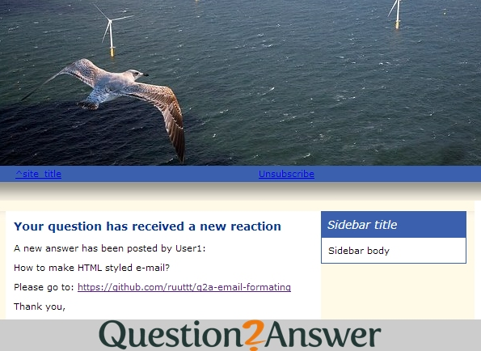

q2a-email-formating
===================

What is it
===================
Plugin for question2answer which enables you to apply html based formatting to all e-mails send out.

How to Install
===================
Create a folder named 'email-formating' within your qa-plugin folder and add all files there. You can remove the file screenshot.jpg. The other .jpg images can be deleted after you have adjusted the css code in the admin panel.

How to use
===================
- Scroll down to Admin/plugins/E-mail formatting
- Click the enable checkbox
- Adjusted the css to fit your needs. 
